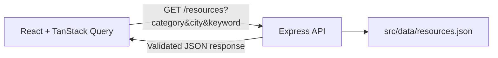

# Harbor Help Directory

> A calm, accessible starting point for finding local support.

Harbor Help Directory is the Day 5 React and Express directory in a 30-day Community Resource Navigator roadmap. The responsive React client searches a typed, read-only API for its fictional local-service listings.

The project focuses on the essential public-facing experience: make support information easier to scan, filter, and act on when someone needs practical next steps.


<p align="center">
	
</p>

## Target users

- Residents who need reliable starting points for food, housing, health, legal aid, jobs, or education.
- Community organizers who want a simple model for presenting local listings.

## Problem statement

Support information is often scattered across outdated pages and difficult to scan under pressure. Harbor Help groups a small fictional service directory into clear categories, lets visitors narrow listings by need and location, and keeps contact details in a focused resource view.

## Features

- 12 fictional Boston-area resource listings.
- Live keyword search and URL-driven category and city filters.
- Category filters for Food, Housing, Health, Legal Aid, Jobs, and Education.
- Focused resource-detail view with address, phone, website, eligibility, and hours.
- Loading, empty, and error-style states for the directory surface.
- Responsive desktop and mobile layouts.
- Reusable, typed search, filter, resource-card, and resource-detail components.
- Visible keyboard focus states, labelled controls, semantic result lists, and live result updates.
- Express REST API with typed Zod validation for resource searches.
- TanStack Query-powered API search with loading, retry, and no-results states.

## Built with

- React
- TypeScript
- Vite
- React Router
- Express
- Zod
- TanStack Query
- CORS
- Modern CSS

## Run locally

Install dependencies once:

```bash
npm install
```

In one terminal, start the Express API:

```bash
npm run api
```

In a second terminal, start the React client:

```bash
npm run dev
```

Open the local URL printed by Vite. The client calls `http://localhost:3001/resources` by default. Set `VITE_API_URL` before starting Vite to point at another API base URL. Create a production bundle with:

```bash
npm run build
```

## Architecture



The Express API validates search parameters with Zod, enables CORS for the local browser client, and reads the fictional JSON seed data. It listens on `http://localhost:3001` by default; set `PORT` to use a different port.

## API endpoints

### `GET /resources`

Returns all resources, or filters them using validated optional query parameters. `category` accepts the URL-safe values `food`, `housing`, `health`, `legal-aid`, `jobs`, and `education`. `city` matches a listed city, while `keyword` searches the resource name, category, address, city, and eligibility text.

```bash
curl http://localhost:3001/resources
curl "http://localhost:3001/resources?category=food"
curl "http://localhost:3001/resources?city=Boston&keyword=housing"
```

Invalid query parameters return `400`, including unsupported categories and blank values.

### `GET /resources/:id`

Returns one resource by its positive numeric ID, or `404` when that resource is not present.

```bash
curl http://localhost:3001/resources/3
```

### `GET /categories`

Returns the supported display category names.

```bash
curl http://localhost:3001/categories
```

## URL filters

Category and city are stored in the URL, so a filtered directory view can be shared or refreshed without losing context.

```text
/?category=food&city=Boston
```

The accepted categories are `food`, `housing`, `health`, `legal-aid`, `jobs`, and `education`.

## Project structure

```text
.
|- index.html                 # Vite entry point
|- src/
|  |- data/resources.json     # API seed data
|  |- main.tsx                # React directory experience and API queries
|  |- styles.css              # Responsive visual design
|  `- types.ts                # Resource contract
|- server/
|  |- app.ts                  # Express routes and Zod validation
|  `- index.ts                # Local API server entry point
|- package.json               # Vite development commands
|- tsconfig.api.json          # API TypeScript validation
`- assets/screenshots/        # README previews
```

## Resource data model

| Field | Description |
| --- | --- |
| `id` | Unique numeric identifier |
| `name` | Public service name |
| `category` | Service type, such as Food or Housing |
| `address` | Public location or service area |
| `phone` | Contact phone number |
| `website` | Public service URL |
| `eligibility` | Who can use the service |
| `hours` | Operating hours |

All data in this prototype is fictional. The seed records live in [src/data/resources.json](src/data/resources.json).

## Component inventory

| Component | Responsibility |
| --- | --- |
| `SearchBar` | Collects keyword and location input, and clears active search terms. |
| `FilterPanel` | Presents category filters with an announced selected state. |
| `ResourceCard` | Displays one matching resource and selects its detail view. |
| `ResourceDetail` | Presents the selected service's full contact and eligibility information. |

## Accessibility checklist

- [x] Every search field has a visible, programmatic label.
- [x] Interactive controls have high-visibility keyboard focus states.
- [x] Category filters expose their selected state with `aria-pressed`.
- [x] Search-result counts and detail changes use polite live regions.
- [x] Search results use semantic list markup and the selected result is identified with `aria-current`.
- [x] Color is not the only category indicator; resource cards include text category labels.

## Roadmap context

Day 1 established the static directory experience. Day 2 recreated that public flow with React, typed local data, and URL-driven filters. Day 3 extracted the core components and completed an accessibility pass. Day 4 added a validated Express API over the same JSON-backed data. Day 5 connects the React client through TanStack Query and CORS, with API-backed loading, retry, and no-results states. Later milestones add persistence, organizer workflows, and AI-assisted resource maintenance.
