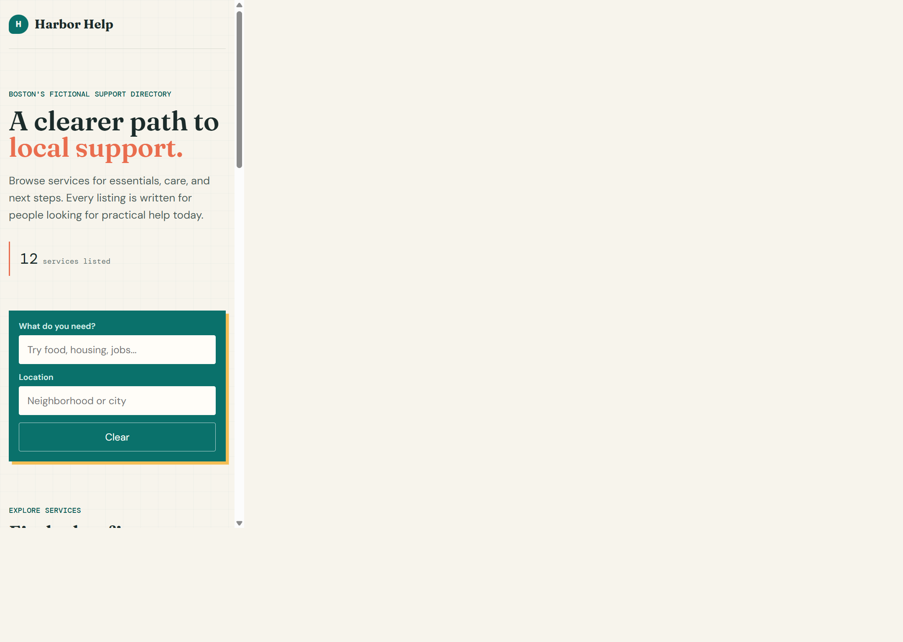
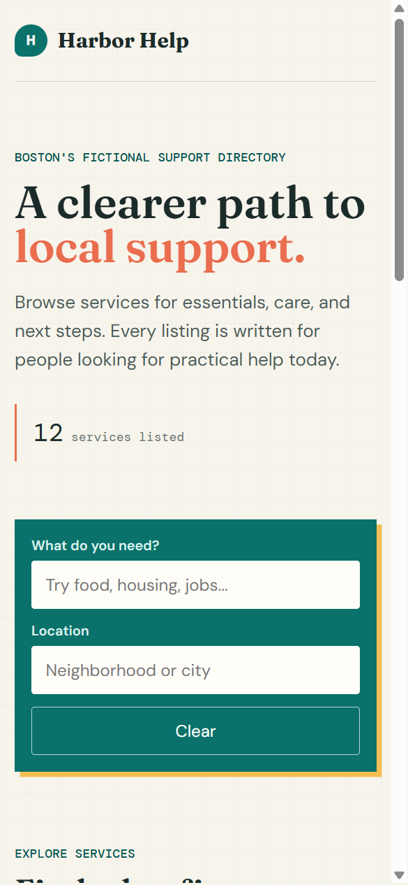

# Harbor Help Directory

> A calm, accessible starting point for finding local support.

Harbor Help Directory is the first project in a 30-day Community Resource Navigator build roadmap. It is a responsive, client-side directory that helps people quickly browse fictional local services for food, housing, health, legal aid, jobs, and education.

The project focuses on the essential public-facing experience: make support information easier to scan, filter, and act on when someone needs practical next steps.



<p align="center">
	
</p>

## Target users

- Residents who need reliable starting points for food, housing, health, legal aid, jobs, or education.
- Community organizers who want a simple model for presenting local listings.

## Problem statement

Support information is often scattered across outdated pages and difficult to scan under pressure. Harbor Help groups a small fictional service directory into clear categories, lets visitors narrow listings by need and location, and keeps contact details in a focused resource view.

## Features

- 12 fictional Boston-area resource listings.
- Live keyword and location search.
- Category filters for Food, Housing, Health, Legal Aid, Jobs, and Education.
- Focused resource-detail view with address, phone, website, eligibility, and hours.
- Responsive desktop and mobile layouts.
- Visible keyboard focus states and labelled form controls.

## Built with

- HTML
- Modern CSS
- Vanilla JavaScript

## Run locally

Open [index.html](index.html) in a browser. No dependencies or server are required.

## Project structure

```text
.
|- index.html                 # Page structure
|- styles.css                 # Responsive visual design
|- app.js                     # Seed data and interactive behavior
`- assets/screenshots/        # README previews
```

## Resource data model

| Field | Description |
| --- | --- |
| `id` | Unique numeric identifier |
| `name` | Public service name |
| `category` | Service type, such as Food or Housing |
| `address` | Public location or service area |
| `phone` | Contact phone number |
| `website` | Public service URL |
| `eligibility` | Who can use the service |
| `hours` | Operating hours |

All data in this prototype is fictional. The seed records live in [app.js](app.js).

## Roadmap context

This Day 1 milestone establishes the public directory experience. Later milestones will rebuild it with React, add APIs and persistent data, introduce organizer workflows, and explore AI-assisted resource maintenance.